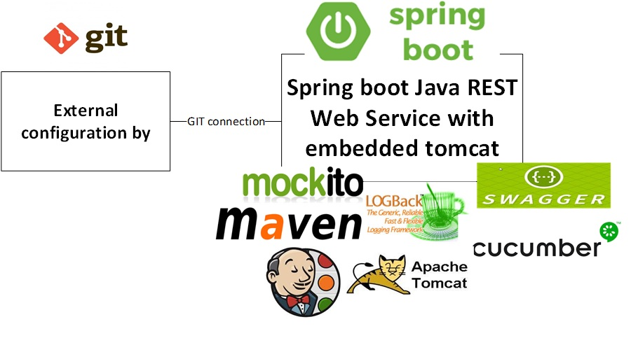

 Spring Boot Quickstart Maven Archetype
=========================================



Summary
-------
The project is a Maven archetype for Spring Boot web application 
which has all common standards on place ready for development

- Java 1.8+
- Maven 3.3+
- Spring boot 1.5.6
- Lombok abstraction
- JPA with H2 for explanation
- Swagger 2 API documentation
- Spring retry and circuit breaker for external service call
- REST API model validation 
- Spring cloud config for external configuration on GIT REPO
- Cucumber and Spring Boot test for integration test
- Jenkins Pipeline for multi branch project
- continuous delivery and integration standards with Sonar check and release management
- Support retry in sanity checks 
- Logback configuration  


Installation
------------

To install the archetype in your local repository execute following commands:

```sh
$ git clone https://github.com/Romeh/spring-boot-quickstart-archtype.git
$ cd spring-boot-quickstart-archtype
$ mvn clean install
```

Create a project
----------------

```sh
$ mvn archetype:generate \
     -DarchetypeGroupId=com.romeh.spring-boot-archetypes \
     -DarchetypeArtifactId=spring-boot-quickstart \
     -DarchetypeVersion=1.0.0 \
     -DgroupId=com.test \
     -DartifactId=sampleapp \
     -Dversion=1.0.0-SNAPSHOT \
     -DinteractiveMode=false
```

Test on the browser via SWAGGER
-------------------

```sh
http://localhost:8080/swagger-ui.html
```

Sample app generated from that archetype can be found here :
-------------------
https://github.com/Romeh/spring-boot-sample-app
